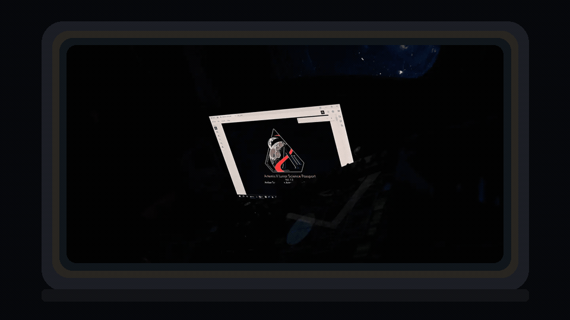

# artemis2



A 1280×720 still of the same view is [`docs/hero-still.png`](docs/hero-still.png).

Python toolkit for NASA's Artemis II lunar-science release on the Planetary Data System, and a static replay that puts you at an Orion window for the 6 April 2026 pass from Aristarchus Plateau to Reiner Gamma.

The page plays the crew's real PCD recordings. It does not synthesize cabin noise or any other audio. Photos are the crew's frames, credited **NASA ID …, Credit: NASA/Artemis II Crew**. This is an independent project. It is not a NASA product and NASA does not endorse it.

## Install

Python 3.10 or newer. `ffmpeg` is needed only when exporting trimmed replay audio.

```bash
pip install -e .
artemis2 --help
```

## Commands

| Command | What it does |
|---|---|
| `artemis2 list` | List products from the public Atlas search API. `--sum` prints counts and bytes. |
| `artemis2 fetch` | Download into a local tree. Defaults to browse `:lg` derivatives, refuses `:md`/`:lg` on TIFF/NEF, checks md5 on full files, and stops above `--max-gb` (0.5) unless you pass `--yes`. |
| `artemis2 index DIR` | Parse PDS4 labels, transcripts, inventories, and the target list into SQLite. Add `--parquet DIR` for Parquet. |
| `artemis2 sync` | One UTC timeline for a window. PCD audio start = embedded end time − exact duration. |
| `artemis2 export replay` | `timeline.json`, trimmed audio, resized frames, footprint GeoJSON. Also `export csv` and `export parquet`. |
| `artemis2 doctor` | The known archive quirks. Pass a directory to check the files you have. |

Atlas access is the documented Imaging Node API: `POST /api/search/atlas/_search` and `GET /api/data/atlas:pds4:artemis2:artemis2:/…`. `terms` queries are sent in batches of 40. The anonymous AWS gateway in the Atlas front end is not used.

## The window

`demo/index.html` is a static page (no build step) for **2026-04-06 19:33:00–19:48:30 UTC**.

```bash
cd demo && python -m http.server 8765
```

`scripts/package_demo.sh` builds an offline zip for a Mac. It is not committed. Unzip it and double-click `Start Demo.command`.

The page opens on a black screen with one line: **Click or press any key to look out the window**. That gesture is what the browser requires before it will play audio. The window then fades up, and the recording starts in step with the clock. The first PCD file begins at 19:33:01.758, so the opening second and a half stays quiet. Nothing is added to fill it.

A small clock in the corner shows UTC and Eastern time (EDT on this date). Mission elapsed time counts from the Data User Guide's mission start, **2026-04-01 22:35:12 UTC**, the start of FD01 and the SLS launch event in that table. It is not a separate liftoff timestamp. The guide is the source. If that field were absent, elapsed time would be left off.

Move the mouse for the map, the scrubber, and the camera controls. `Esc` shows them too. They fade out together, map included, so the subtitle is left on the glass. A one-line key hint appears once per browser session, then stays hidden. `Space` pauses. `Left` and `Right` turn between Window 2 and Window 3. `1`–`4` select Wiseman, Glover, Koch, and Hansen. `F` is fullscreen. While that panel is open, the crew row sits below the corner clock, including on a narrower window. The clock itself is a small dark chip behind the three times, so Eastern time stays readable on a bright cabin frame.

Turning between the windows is a short sideways blur. `prefers-reduced-motion` uses a plain crossfade instead, and turns the drift off. The next photograph is decoded before it fades in. The map moves a label, or draws a short leader, when two names would sit on top of each other. Glushko Crater and Reiner Gamma are the pair that used to collide.

The page is the inner face of one cone window, close to the glass. The opening is the landscape rounded rectangle machined into the crew-module cone panel in NASA image [jsc2022e045980](https://images.nasa.gov/details/jsc2022e045980). Each cone window is three panes — an outer fused-silica thermal pane, a pressure pane, and a redundant pane — and NASA states that the innermost cone-window pane is acrylic ([Orion Windows Provide New Outlook for Spacecraft’s Future](https://www.nasa.gov/missions/artemis/orion/orion-windows-provide-new-outlook-for-spacecrafts-future/); the same three-lite stack is described in [Orion Window Testing Brings Artemis I Closer into View](https://www.nasa.gov/missions/artemis/orion/orion-window-testing-brings-artemis-1-closer-into-view/)). Orion has four of those cone windows plus a side-hatch window and a docking-hatch window. No public dimensioned clear-aperture drawing was found, so the page does not invent millimetres, bolt circles, or seats. The 1.58 aspect is that photographed landscape opening, not a measured clear aperture.

Photographs taken inside Orion that show a window and its bezel also show a crew member in the aperture, so none of them is masked into the wall. Checked in the PDS browse collections and on images.nasa.gov: [art002e004439](https://images.nasa.gov/details/art002e004439) and [art002e004440](https://images.nasa.gov/details/art002e004440) (Hansen at a cone window, cabin lights off; both are in `artemis2_crew_camera` browse), [art002e025643](https://images.nasa.gov/details/art002e025643), [art002e009292](https://images.nasa.gov/details/art002e009292) (Hansen photographing through the window during the flyby; in the crew-camera browse), [art002e009272](https://images.nasa.gov/details/art002e009272), [art002e009273](https://images.nasa.gov/details/art002e009273), [art002e009007](https://images.nasa.gov/details/art002e009007), [art002e008486](https://images.nasa.gov/details/art002e008486), [art002e008487](https://images.nasa.gov/details/art002e008487), [art002e009274](https://images.nasa.gov/details/art002e009274). [art002e009013](https://images.nasa.gov/details/art002e009013) and [art002e009008](https://images.nasa.gov/details/art002e009008) are solar-array views from outside the glass. The Window 2 bezel is drawn to match what those interior frames show: a dark thick reveal, lights off, with the inner lip catching the window. The nearest lip is slightly soft. The wall is not a pasted cabin photograph. Pointer movement and device tilt, when the browser provides them, shift the near frame against the view. A bright Moon darkens the wall. `prefers-reduced-motion` turns the drift, parallax, and Ken Burns off.

### Window 3 (Cab Cam 2)

**Window 2 (Nikon)** and **Window 3 (Cab Cam)** keep the same mission clock. Cab Cam 2 is the GoPro HERO4 Black mounted inside Window 3 (Data User Guide §3.3.1). The archive has 148 browse JPEGs in `artemis2_orion_camera` / `browse_source` (labels say flight day 6; the JPEGs are filed under `fd05`), including art002e000210 and the art002e041313–art002e041450 run. Some `:md` derivatives of that run are near-black masks of about a kilobyte. Those masks are not used. The frames below are the full browse JPEGs. Each JPEG `DateTime` matches the label `start_date_time`.

What those frames actually are:

- **art002e000210** is 2026-04-03T00:30:38Z, a two-second exposure on flight day 2. It is not part of the 6 April flyby, so it is not shown and its time is not moved.
- **art002e041313 through art002e041347**, including the flyby, are short automatic exposures (ISO 100, about 1/500 s, exposure compensation −2, spot meter). The browse JPEGs are nearly black. Mean luminance is about 9. A small bright patch sits near the middle of the 4000×3000 frame, on the order of 450×540 pixels. That is the photograph, not a mask. It is not a sunlit view out the window.
- Two of those dark frames fall inside 19:33:00–19:48:30 UTC: **art002e041322** at 19:34:44Z and **art002e041323** at 19:42:44Z. The nearest frame before the window is **art002e041321** at 19:26:43Z. The next one, art002e041324, is 19:50:44Z. Switching to Window 3 during the flyby shows these real frames, labeled with the time they were taken. If the Orion clock is more than about 45 seconds away, the label says so. The picture is not shifted and not brightened.
- A usable look at the Moon starts at **art002e041348**, 22:36:03Z. From there through art002e041450 (23:27:46Z) the browse JPEGs fill the frame (mean luminance about 65 and up). The shipped slice is art002e041348–art002e041365, one frame every 30 seconds, 22:36:03Z through 22:44:33Z. **Cab Cam run · 22:36 UTC** seeks to that range. **Back to the flyby** returns to the clock you left. Window 2 during that later range does not hold a 19:46 Nikon frame in place of a picture that was not taken then.

The later frames fill the 4:3 picture. A separate window edge is not something this page can trace on top of them, so nothing is drawn over the photograph. Each hold drifts the way Window 2 does: a slow pan and the same small float, with the scale changing by 3.5% across the gap between two real frames. The next photograph dissolves in over the last four seconds and is fully on screen at its own capture time. The taken-time label changes to that frame once it is the brighter of the two. No frames are invented in between. `prefers-reduced-motion` skips the drift and keeps the dissolve. A 1280×720 still with the controls hidden is [`docs/window3-still.png`](docs/window3-still.png). [`docs/window3-view.mp4`](docs/window3-view.mp4) is about 52 seconds of that run, from 22:39:11.395Z to 22:40:03.395Z, with `art002a000045` in sync. It crosses art002e041354, art002e041355, and art002e041356.

**art002a000045** (PCD2, Hansen and Glover) is the recording that overlaps the bright slice. Its embedded creation time, 22:44:19.000Z, is the end. The duration is 307.604833 s, so it starts at **22:39:11.395Z**. From 22:36:03Z until then the clock moves and the speaker stays quiet. No transcript was shipped for this file, so the run has no subtitles. Other PCD files exist later in the evening; they are not in the bundle.

`art002e016183` is a Z9 frame of a lit card in a dark cabin, not a lunar limb. It is shown for a few seconds beside the window and is never placed in the glass. The other Z9 frames in this set are lunar and stay in the window. Before the first of those, at 19:33:26, the glass fades that real frame up with the clock. It does not invent a picture for the gap. PCD audio is the original mix: voices are not panned by speaker, because each file is two people on one recording, and nothing is synthesized. Each file is copied into memory before it plays, so the scrubber can land inside it. The usual `python -m http.server` does not advertise byte ranges, and without that Chrome will not seek the file. Subtitles sit on the glass. They use a stroke and a shadow, plus a dim that follows the words. There is no bar across the Moon. A real-time capture is [docs/window-view.mp4](docs/window-view.mp4).

Shipped media — the demo bundle plus `docs/hero.gif`, `docs/hero-still.png`, `docs/window-view.mp4`, `docs/window3-still.png`, and `docs/window3-view.mp4` — is about 25 MB, under the 35 MB budget. Browse frames are resized to a 1200-pixel long edge. The five flyby PCD files are trimmed to mono 64 kbps AAC, and `art002a000045` is transcoded the same way. The hero still, the hero loop, and the Window 3 still are the page after that panel has hidden: clocks, credit, and subtitle stay, and the map does not cover the line. Rebuild the flyby bundle with `python scripts/rebuild_demo.py` after the cache described in that script is filled. That script keeps the Cab Cam files and merges them back with `scripts/merge_cab_cam.py`, including the mission-start time. `notebooks/replay.ipynb` is the same flyby pipeline.

## Time

PCD M4A files store the **end** of the recording at whole-second resolution (Data User Guide §5.4.1). The start used here is that embedded time minus the exact duration from the file.

`art002a000033` (PCD2, Reiner Gamma) has creation time 19:48:30.000 UTC and duration 135.423771 s, so it starts at **19:46:14.576 UTC**. The label start, 19:46:14Z, is the truncated value. Transcript `utc` on that file matches this start to the millisecond; the `audio_time` column is only the floored second. Tests check both against the real sample.

Voice-loop files are not one continuous recording. `art002_2026-04-06_oe1` jumps by about 8.5 hours at audio time 06:23:41. Loops are mapped piecewise through each line's `utc`. They are not the demo clock.

Camera clocks were checked against the PCD before each activity. The residual is not in the archive. The slider adds seconds to photo timestamps before they are compared with the audio clock. Expect about ±1–2 s of absolute uncertainty.

## Who is speaking, and who held the camera

Transcript speakers are real: Wiseman, Glover, Koch, Hansen, plus CAPCOM, SCIENCE, and Crew. Labels such as `Hansen ` and `Glover [CAPCOM]` are normalized. Switching to a person keeps the same moment, highlights their lines, and selects the PCD that recorded them.

That PCD assignment is Data User Guide Table 6, and it is an audio assignment:

- PCD2 recorded Hansen and Glover.
- PCD3 recorded Koch and Wiseman.

**There is no per-person photo attribution.** The labels have no photographer field. The guide's credit line is the generic "NASA/Artemis II Crew", and Table 4 assigns the flyby to "All crew members." The page therefore does not filter frames by person. It filters by camera:

- **Window 2 · D5-015** (`nkd5015`) — the guide's primary flyby camera, the long lens at Window 2. That is a configuration note, not a per-frame window tag.
- **Z9** (`nkz9019`) — no window is assigned in the labels.
- **Window 3 · Cab Cam 2** (`cab2`) — the GoPro inside Window 3. It is its own switch, not mixed into the Nikon reel. SAW Cam 3 still looks in from the solar array; its still cadence is about one frame every eight minutes, and none of those stills is in the shipped set.

Crew annotations in the release are image-only PDFs with no timestamps. The OneNote sets cover NASA IDs art002e009303–e009560, which are earlier than this window, so the page does not pretend to show someone's notes at 19:46.

## Pointing

The PDS SPICE bundle is delayed. NAIF has published a reconstructed Orion trajectory and no CK, FK, or SCLK, so a window's look direction cannot be computed. `artemis2.pointing.PointingProvider` is the seam: `boresight(utc, window_id)` returns `None` until a kernel-backed provider exists. The map draws LTP targets that have real coordinates, and the footprints of georeferenced frames. Those footprints are not a window boresight.

Hertzsprung Basin is stored at latitude 0, longitude 0 in the outgoing target request. It is not plotted.

## Footprints

On the D5 processed labels, `vertical_coordinate_pixel` runs to 5568 (the sample count) and `horizontal_coordinate_pixel` runs to 3712 (the line count). The display axes in the same label are Sample left-to-right and Line top-to-bottom, so the field names are swapped. A corner at vertical = 5568 cannot be a line index. Plotted the other way, control points fall on the lunar surface in both a full-disk Orientale frame (`art002e009600`) and a 400 mm Reiner Gamma frame (`art002e009943`), and they stay off the black sky.

The corner polygon is a homography extrapolated to the frame (the guide calls the fit affine). On both checked labels that box runs well past the control points, so drawn footprints are the **control-point convex hull** when the corners diverge. Nine shipped frames have no geometry. Target tags were "not thoroughly verified" (guide Table 17) and are shown as tags.

## Data quirks

`artemis2 doctor` prints these, and checks them when the files are local:

- Delayed SPICE bundle; no attitude kernels.
- `art002a000033` start 19:46:14.576 versus a truncated label.
- Discontinuous voice loops; malformed `utc` `2026-04-06 03:10:201200`; three date-only rows.
- `art002_2026-04-07_oe2` is named 7 April and timed 6 April.
- fd04 `art002a000001`/`a000003` and `a000002`/`a000004` share times with different `activity_id` values. `art002a000052_pcd1_src` is outside the collection inventory.
- Orion `channel2` is missing `art002m1020961941`.
- 10,329 archived crew images per level, against 10,339 in the guide's Figure 7. Atlas byte totals are about 2.57 TB, not the blog's "more than 800 gigabytes."
- Still unreleased: iPhone 17 Pro Max collection, lens-distortion PDF, HERA, the SPICE bundle. The Data User Guide DOI does not resolve yet.
- DCAM times may be off by minutes. OpNav times were reconstructed from filenames.

Code follows the archive, not the guide, where they disagree (`_saw3_raw_` rather than `_vid_`).

## Tests

```bash
python -m pytest
```

Fixtures are real sample products, including the `art002a000033` M4A, its label and transcript, the Orientale processed label, both voice-loop CSVs, the fd04 duplicate labels, the PCD inventory, and the outgoing target list.

## Licenses and usage

NASA images, audio, and related media are generally not subject to copyright in the United States. Acknowledge NASA as the source of anything taken from these bundles. Do not use the material in a way that suggests NASA endorses this project. NASA insignia and identifier rules are separate from that media guidance; this project does not use the NASA logo as its own mark. The agency's media page is [NASA Guidelines for Using Media](https://www.nasa.gov/nasa-brand-center/images-and-media/). The same note is on every entry in `licenses` inside `demo/data/timeline.json`.

| Source | What this project uses | Credit |
|---|---|---|
| `artemis2_crew_camera` ([10.17189/x52v-tb80](https://doi.org/10.17189/x52v-tb80)) | Flyby stills. Atlas browse derivatives, resized to a 1200-pixel long edge. Labels have no photographer field. | NASA ID …, Credit: NASA/Artemis II Crew |
| `artemis2_orion_camera` ([10.17189/hzev-nq50](https://doi.org/10.17189/hzev-nq50)) | Cab Cam 2 browse JPEGs from `browse_source/fd05`, full files rather than `:md` masks, resized the same way. Times are the label times. | NASA ID …, Credit: NASA/Artemis II Crew |
| `artemis2_mission_audio` ([10.17189/4a29-dz64](https://doi.org/10.17189/4a29-dz64)) | Real PCD M4A. Flyby clips are trimmed to 19:33–19:48:30. `art002a000045` is the whole file and stays on 22:39:11.395–22:44:19.000 UTC. Both are mono 64 kbps AAC. Nothing is synthesized. | NASA Artemis II crew PCD recordings |
| `artemis2_mission` ([10.17189/36fx-pd80](https://doi.org/10.17189/36fx-pd80)) | Outgoing target names and coordinates for the map, and the Data User Guide for window and PCD assignments. Hertzsprung Basin is stored at 0,0 and is not plotted. | NASA PDS Artemis II mission bundle |
| Cited, not shipped | jsc2022e045980; interior frames art002e004439, art002e004440, art002e009292, art002e025643, and the other interior IDs named above; Cab Cam frame art002e000210 (3 April 2026); NASA.gov articles on the Orion windows. | NASA |

## Bundles

| Bundle | DOI |
|---|---|
| `urn:nasa:pds:artemis2_crew_camera` | [10.17189/x52v-tb80](https://doi.org/10.17189/x52v-tb80) |
| `urn:nasa:pds:artemis2_orion_camera` | [10.17189/hzev-nq50](https://doi.org/10.17189/hzev-nq50) |
| `urn:nasa:pds:artemis2_mission_audio` | [10.17189/4a29-dz64](https://doi.org/10.17189/4a29-dz64) |
| `urn:nasa:pds:artemis2_mission` | [10.17189/36fx-pd80](https://doi.org/10.17189/36fx-pd80) |

The SPICE DOI 10.17189/7ezn-0294 and the Data User Guide DOI 10.17189/dtpt-2857 were not resolving when this was written. The guide itself is [artemis2_data_user_guide.pdf](https://pds-geosciences.wustl.edu/artemis2/urn-nasa-pds-artemis2_mission/document/artemis2_data_user_guide.pdf) at the Geosciences Node.

Out of scope for v1: radiometry, lens correction, SPICE pointing, Orion video frame extraction, and the unreleased iPhone collection.
